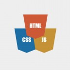

# EnglishGrammatic
.gif)
## Приложение для изучения английского языка
## Демо: https://pavelcydep.github.io/EnglishGrammatic/

Увлекаясь обучения иностранным языком, я понял, что полезно полезно обращать внимание не только на грамматические правила и лексические единицы: важно также осознавать красоту звучания речи. Особенно проявляют языковую уникальность и своеобразность известные цитаты, расхожие афоризмы и просто красивые фразы на английском. Это вдохновило меня на создание небольшого приложения для проверки полученных знаний.

****
Возможности использования
=========================
- Проверка знаний Английского языка.
- После прохождения можно увидеть количество правильных ответов и таблицу с данными прохождения другими участниками.
- С помощью алгоритма Фишера-Йетса, данные постоянно перетасуются.

Как установить проект?
================
## Для начала работы вам необходим:

- <a href="https://nodejs.org/en/">NodeJS & npm<a> - среда выполенния кода JavaScript вне браузера. Позволяет писать серверный код для динамических веб-страниц и веб-приложений.
- <a href="https://gitforwindows.org/">Git Bash<a> если вы используете Windows OS.

## Установка

### Склонировать проект на ПК:

    git clone
 

### Установить зависимости

    npm install

## Работа

#### Запуск демо:

    npm run dev
    
Это приведет к запуску локального сервера доступного по ссылке http://localhost:8080/, все файлы будут компилироваться в режиме разработки.

#### Для сборки проекта в production:

    npm run build
    
#### Для деплоя на GitHub pages:

    npm run deploy

Стек технологий
===============
  

 

